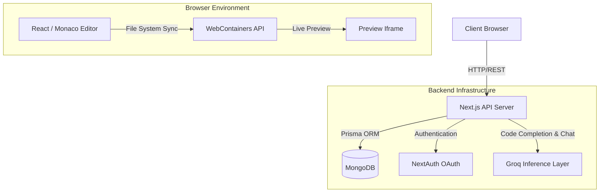

# ⚡ Chai Vibe Editor

An advanced, browser-native AI-powered code editor built on top of **WebContainers**, empowering developers to spin up full-stack development environments (React, Next.js, Express, Vue, Angular) directly in the browser—no remote VMs required.

Featuring deep AI integration utilizing Groq's high-speed inference layer, this editor natively supports intelligent code completion, an interactive AI coding assistant, and instant preview rendering.

---

## 🏗 System Architecture



### Frontend Layer
- **Framework:** Next.js 16 (App Router) with Turbopack for lightning-fast local development and HMR.
- **UI Library:** React 19 Client/Server components.
- **Styling:** Tailwind CSS + Radix UI Primitives (ShadCN) providing a highly aesthetic, VSCode-like dark/light theme environment.
- **Layout Engine:** `react-resizable-panels` drives the deeply customizable editor, terminal, and preview splits.
- **Code Editor:** Monaco Editor (`@monaco-editor/react`) powers the central coding interface.
- **Terminal Emulator:** `xterm.js` integrated seamlessly with WebContainer processes.

### Execution Engine (Browser Native)
- **WebContainers API:** The core infrastructure running Node.js natively inside a secure Cross-Origin isolated browser iframe. This allows the editor to run `npm install` and start live dev servers (`npm run dev`) client-side without relying on expensive remote docker containers.

### Backend Layer
- **Database ORM:** Prisma ORM.
- **Database Provider:** MongoDB.
- **Authentication:** NextAuth.js (Auth.js) configured with seamless Google and GitHub OAuth providers for secure session persistence.
- **AI Intelligence:** Integrated with Groq (`groq/compound`) for blazing fast `<200ms` contextual AI autocomplete and chatbot capabilities.

---

## 🧠 AI Integration

Chai Vibe integrates AI natively into the developer flow:
1. **Intelligent Autocomplete:** As you type in the Monaco Editor, background requests are dispatched to Groq's APIs, analyzing the surrounding AST context (imports, functions, comments) and suggesting the next logical block of code.
2. **Contextual Chat Assistant:** An integrated sidebar bot that understands the file you are actively viewing and assists with debugging, code generation, and architectural design.

---

## 🚀 Getting Started

### Prerequisites
- Node.js > 18.x
- MongoDB Instance
- Groq API Key
- OAuth Credentials (Google/GitHub)

### 1. Clone & Install
```bash
git clone https://github.com/realranjan/Ai-Vibe-Code-Editor.git
cd Ai-Vibe-Code-Editor
npm install
```

### 2. Configure Environment Variables
Create a `.env.local` file in the root directory:
```env
DATABASE_URL="mongodb+srv://<auth>@<cluster>.mongodb.net/chai-vibe-editor"
AUTH_SECRET="your-32-character-secret"

# OAuth Providers
AUTH_GITHUB_ID="your-github-id"
AUTH_GITHUB_SECRET="your-github-secret"
AUTH_GOOGLE_ID="your-google-id"
AUTH_GOOGLE_SECRET="your-google-secret"

# AI Inference Layer
GROQ_API_KEY="your-groq-api-key"
```

### 3. Initialize Prisma Database
```bash
npx prisma generate
npx prisma db push
```

### 4. Run Development Server
```bash
npm run dev
```
Navigate to `http://localhost:3000`.

---

## 📂 WebContainer Template System

The application dynamically bootstraps starter projects into the WebContainer filesystem. Templates are stored in the `/vibecode-starters` directory, heavily optimized and traced for serverless (Vercel) builds to ensure seamless deployment and instantaneous playground generation.

Supported out-of-the-box starters:
- React (Vite)
- Next.js
- Express (API)
- Hono
- Vue
- Angular
